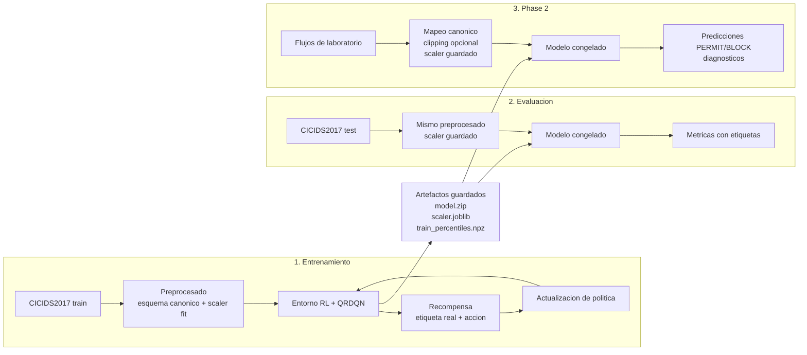

# 07 — Artefactos, scripts, tests y validacion

Este documento responde a una pregunta practica de memoria/defensa: que guarda el proyecto, por que lo guarda y como se conecta cada artefacto con entrenamiento, evaluacion e inferencia Phase 2.

## 1) Pipeline conceptual: donde se aprende y donde no

El sistema tiene tres momentos distintos:

La regla importante es esta:

- en entrenamiento, QRDQN aprende actualizando su politica con recompensas;
- en evaluacion y Phase 2, el modelo esta congelado y solo predice;
- si hay etiquetas en evaluacion o en un CSV de Phase 2, se usan para medir, no para aprender.

## 2) Artefactos de entrenamiento

Cada run de entrenamiento serio queda organizado por `RUN_ID` bajo `runs/cicids2017/<RUN_ID>/` y con una copia del modelo en `models/<RUN_ID>.zip`.

| Artefacto | Que es | Por que importa |
|-----------|--------|-----------------|
| `model.zip` | Modelo QRDQN entrenado. | Permite cargar exactamente la politica aprendida sin reentrenar. |
| `scaler.joblib` | `StandardScaler` ajustado solo con train. | Garantiza que test y Phase 2 usan la misma escala que vio el modelo al entrenar. |
| `train_percentiles.npz` | Percentiles `p0.5` y `p99.5` de las 76 features canonicas de train. | Permite clipping robusto de outliers antes del escalado en Phase 2. |
| `config.json` | Configuracion efectiva del run: dataset, split, seed, hiperparametros, reward, rutas. | Es la fuente para reproducir o explicar un experimento concreto. |
| `metrics.json` | Metricas finales del run. | Da resultados medidos, no narrativos. |
| `environment.json` | Versiones y entorno de ejecucion. | Ayuda a explicar reproducibilidad y diferencias CPU/GPU/RunPod. |
| `feature_names.json` | Orden de las 152 columnas de observacion. | Evita ambiguedad sobre que significa cada posicion del vector. |
| `artifact_manifest.json` | Indice de artefactos del run. | Sirve como checklist de descarga, auditoria y trazabilidad. |
| `events.out.tfevents.*` | Logs TensorBoard generados por Stable-Baselines3. | Permiten reconstruir curvas de entrenamiento sin meter logica extra en el bucle de aprendizaje. |

### `scaler.joblib`

El `scaler` guarda medias y desviaciones aprendidas en train. Es critico porque la red no aprende sobre valores crudos, sino sobre valores estandarizados. Si en Phase 2 se recalculase un scaler nuevo con trafico real, se cambiaria el significado numerico de las entradas y la comparacion con entrenamiento dejaria de ser limpia.

Respuesta corta para tribunal: el scaler es parte del modelo experimental. No es un accesorio; define la escala exacta de entrada que espera la red.

### `train_percentiles.npz`

Este archivo guarda limites bajos y altos por feature calculados solo en train. En Phase 2, `scripts/predict_real_traffic_v2.py` puede recortar valores crudos a ese rango antes de aplicar el scaler.

Esto no hace que el modelo sea automaticamente robusto, pero reduce el riesgo de que valores extremos de laboratorio produzcan z-scores absurdas y empujen la red fuera del regimen visto durante entrenamiento.

Respuesta corta para tribunal: los percentiles son una barrera anti-outliers basada en train, no una calibracion aprendida con test.

### `events.out.tfevents.*`

TensorBoard registra escalares como reward, perdida u otros valores que SB3 emite durante el aprendizaje. No son el resultado final por si solos, pero ayudan a ver si el entrenamiento fue estable, si hubo colapsos y como evoluciono la senal.

El script `scripts/export_tensorboard_scalars.py` convierte esos eventos en CSV y PNG para usarlos en memoria o defensa.

Respuesta corta para tribunal: TensorBoard sirve para auditar la dinamica del entrenamiento; `metrics.json` resume el resultado final.

## 3) Metricas y como leerlas

En clasificacion binaria del proyecto:

- `0 = BENIGN / PERMIT`
- `1 = ATTACK / BLOCK`

La matriz de confusion se interpreta asi:

| Conteo | Significado operativo |
|--------|-----------------------|
| `TP` | ataque bloqueado correctamente |
| `TN` | benigno permitido correctamente |
| `FP` | benigno bloqueado por error |
| `FN` | ataque permitido por error |

Metricas principales:

- `accuracy`: proporcion total de aciertos. Es util, pero puede ocultar fallos si hay desbalance.
- `precision_attack`: de lo que el modelo bloquea como ataque, cuanto era realmente ataque.
- `recall_attack`: de todos los ataques reales, cuantos bloquea. En ciberseguridad suele ser critica.
- `f1_attack`: equilibrio entre precision y recall de ataque.
- `block_rate`: porcentaje de flujos bloqueados en Phase 2; existe aunque no haya etiquetas.
- `allow_rate`: porcentaje de flujos permitidos en Phase 2.
- `fpr`: proporcion de benignos bloqueados por error.
- `fnr`: proporcion de ataques permitidos por error.
- `balanced_accuracy`: media entre recall benigno y recall ataque; ayuda cuando las clases estan desbalanceadas.
- `reward_per_sample`: recompensa media bajo la funcion de costes definida.

Regla de defensa: una accuracy alta en random split no demuestra robustez real. Hay que leerla junto con Check B, Check C, leave-one-exact-CSV-out y Phase 2.

## 4) Clipping, z-scores y domain shift

Phase 2 usa trafico extraido fuera de CICIDS2017. Eso introduce riesgo de `domain shift`: la distribucion de features reales puede no parecerse a la distribucion de entrenamiento.

### Clipping percentilar

Funcion: `apply_percentile_clipping` en `src/scaling_utils.py`.

Se aplica antes del scaler y sobre features crudas. Usa `train_percentiles.npz` para recortar cada feature a un rango observado en train. No toca la mascara de missingness.

### Clipping z-score

Funcion: `apply_z_clipping` en `src/scaling_utils.py`.

Se aplica despues de `StandardScaler.transform`. Limita valores escalados a `[-max_z, +max_z]`, por ejemplo con `--clip-z 10.0`.

### Diagnosticos de z-score

Funcion: `compute_diagnostics` en `scripts/predict_real_traffic_v2.py`.

Calcula, sobre las 76 features canonicas escaladas:

- `z_abs_max`: maxima desviacion absoluta;
- `z_abs_mean`: desviacion absoluta media;
- `z_gt10_count`: numero de valores con `|z| > 10`;
- `z_gt10_pct`: porcentaje de valores con `|z| > 10`;
- `top_features`: features con desviaciones mas extremas.

Respuesta corta para tribunal: el clipping intenta contener outliers; los diagnosticos dicen si el trafico se parece o no al regimen de entrenamiento.

## 5) Mapa de scripts principales

| Script | Papel defendible |
|--------|------------------|
| `src/train_rl_defender.py` | Entrena QRDQN sobre CICIDS2017, guarda modelo, scaler, percentiles, config, metricas y manifiesto. |
| `src/validate_checks.py` | Ejecuta Check A, Check B y Check C para validar rendimiento directo, anti-leakage y generalizacion por dia/CSV. |
| `src/validate_leave_one_csv_out.py` | Ejecuta validacion por folds dejando fuera un CSV oficial completo cada vez. |
| `scripts/predict_real_traffic_v2.py` | Ejecuta inferencia offline Phase 2 con modelo congelado, scaler persistido, clipping opcional y diagnosticos. |
| `scripts/export_tensorboard_scalars.py` | Exporta logs TensorBoard a CSV/PNG aptos para memoria. |
| `src/baseline_random_forest.py` | Baseline supervisado no-RL para comparar contra QRDQN bajo splits equivalentes. |
| `scripts/verify_fixed_test_split.py` | Verifica que benchmarks con `train_max_rows` mantienen fijo el test set y audita el scaler frente al run principal. |

## 6) Tests unitarios vs validaciones experimentales

Los tests de `tests/` y las validaciones de `runs/validation/` no responden a la misma pregunta.

| Tipo | Pregunta | Ejemplos |
|------|----------|----------|
| Tests unitarios | El codigo respeta invariantes pequenos y funciones concretas? | `test_canonical_schema.py`, `test_load_cicids2017.py`, `test_reward_config.py`, `test_predict_real_traffic_v2.py` |
| Validaciones experimentales | El modelo y el pipeline se comportan bien bajo un protocolo de evaluacion? | Check A, Check B, Check C, leave-one-exact-CSV-out |

Ejemplos:

- `test_canonical_schema.py` comprueba longitud de features y logica de mascara.
- `test_reward_config.py` comprueba que la recompensa codifica TP/FP/FN/omission correctamente.
- `test_load_cicids2017.py` comprueba, entre otras cosas, que `train_max_rows` no cambia el test set.
- `test_predict_real_traffic_v2.py` comprueba conversion de unidades y diagnosticos.

Respuesta corta para tribunal: los tests reducen riesgo de bugs de implementacion; las validaciones miden comportamiento experimental.

## 7) Que validamos, como y por que

| Validacion | Como se hace | Por que importa |
|------------|--------------|-----------------|
| Check A | Prediccion directa del modelo contra `y_test`. | Evita depender de mecanicas internas del entorno para medir. |
| Check B | Reentrenamiento con etiquetas barajadas. | Si el rendimiento siguiera alto, habria sospecha de leakage. |
| Check C | Entrenar y evaluar en dias/CSV distintos. | Mide generalizacion mas dura que random split. |
| Leave-one-exact-CSV-out | Cada fold deja fuera un CSV oficial completo. | Separa por archivo real y permite analizar variabilidad por captura/dia. |
| Phase 2 | Inferencia offline sobre flujos de laboratorio. | Mide comportamiento fuera del dataset, con riesgo real de domain shift. |

No se debe mezclar:

- benchmark interno CICIDS2017;
- validacion experimental A/B/C;
- Phase 2 sobre trafico de laboratorio.

Cada afirmacion fuerte debe citar el `RUN_ID` o artefacto correspondiente.

## 8) Respuestas cortas tipo tribunal

**Por que guardas el scaler?**  
Porque el modelo fue entrenado con una escala concreta. Reusar el scaler evita cambiar el significado numerico de las entradas en test y Phase 2.

**Por que guardas los percentiles?**  
Porque Phase 2 puede traer outliers que no existian en CICIDS2017. Los percentiles permiten recortar valores crudos usando solo informacion aprendida de train.

**Que significan los z-values?**  
Son desviaciones respecto a la escala de entrenamiento. Un `|z|` muy alto indica que la feature esta muy fuera de lo que el scaler vio en train.

**Que miden los eventos TensorBoard?**  
La evolucion del entrenamiento. Sirven para auditar curvas, no para sustituir las metricas finales.

**Que diferencia hay entre `metrics.json` y `diagnostics.json`?**  
`metrics.json` resume resultado/prediccion; `diagnostics.json` explica distribucion de entrada y posibles sintomas de shift.

**Que aprende durante Phase 2?**  
Nada en la implementacion actual. Phase 2 usa modelo congelado para inferencia offline.

**Por que tantos scripts de validacion?**  
Porque cada uno controla un riesgo distinto: medicion directa, leakage, generalizacion por dias y generalizacion por CSV exacto.

**Cual es la limitacion principal que queda?**  
La robustez frente a domain shift en trafico real de laboratorio. El pipeline puede medirlo y versionarlo, pero no esta cerrado como despliegue activo.
